> [!WARNING]  
> This is a beta version. Please, be patient if find any bug and report it.

# Vinapp HkE

Vin HkE is an extension implementation for Hammerhead Karroo based on Vin's CORE and the new Hammerhead SDK for its GPS devices. Tested in Hammerhead K2 and K3 devices. Vin is an Android training and planning app for cycling with more than 4 years of life and a 5-star rating on Google Play.

## HkE Installation

Currently, Hammerhead has NOT YET released an on-device app store for easy installation of apps. Until then, you can sideload the app with Hammerhead Companion app.

https://support.hammerhead.io/hc/en-us/articles/31576497036827-Companion-App-Sideloading 

If companion app does not install HkE for your device can follow this tutorial:

* Download the Vin-HkE.apk from the latest release page.
      https://github.com/maduwatas/Vin-HkE/releases/download/latest/Vin-HkE.apk
* Prepare your Karoo for sideloading by following this step-by-step guide
      https://www.dcrainmaker.com/2021/02/how-to-sideload-android-apps-on-your-hammerhead-karoo-1-karoo-2.html
* Install the app using the command adb install Vin-HkE.apk.

 After install you can see the Vin HkE main menu.

# HkE app Navigation

### Main menu

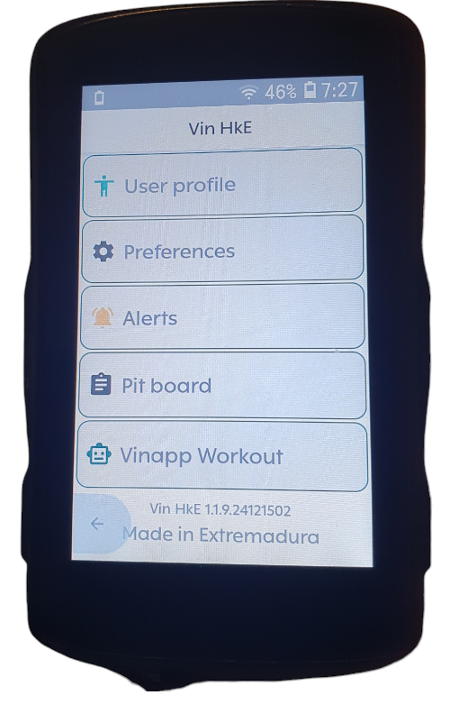

Main menu provides access to user settings and configuration of basic functionalities of Vin HkE.

### User profile configuration

User profile | Power threshold data | Hear rate threshold data | Nutritional data
------------- | ------------- | ------------- | -------------
 |  |  | 

Some data are imported from the karoo user profile. This data is not editable, all other data can be edited within the supported values. From user profile you can edit some data and pushing Threshold button navigate to power threshold or hear rate threshold configuration page. The user's gender, weight, height and threshold data are necessary to adjust the calculations of calories burned in the activity. The nutritional data provides information on these calculations for different intensities.

### Preferences

#### Battery saving options

<table border="0">
    <tr>
        <td width="50%" >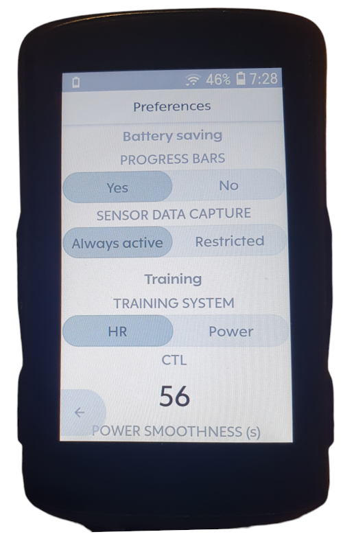</td>
        <td width="50%">

##### Progress bars
Some HkE widgets include beautiful and useful progress bars to represent data. Drawing these views on the screen consumes a small amount of battery, which you can save by choosing to hide them.

##### Sensor data capture
When you start a ride, HkE starts its calculations in the background to obtain real-time data of calories, averages, normalized data... this data is required for some HkE widgets such as power, heart rate or calories. Other functionalities such as alerts, power balance or Pit board do not need these calculations. If you are using a profile without HkE widgets with the background process required, you can disable it to save a small amount of battery. If you start a ride without starting HkE background calculations and later decide choosing an HkE profile some data could not work, due background calculations would not running.
        </td>
    </tr>
</table>

#### Training options

<table border="0">
    <tr>
        <td width="50%" >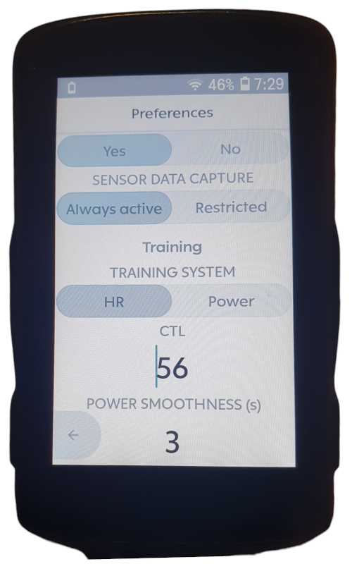</td>
        <td width="50%">

##### Training system
Choose Heart rate based or Power based workouts.

##### CTL
Your chronic training load is a measure of your fitness that is used as a calculation parameter for HkE algorithms. If you don't know this value, you can get it from the statistics functionality of Vinapp or other training platforms. If you install vinapp and synchronize your training history CTL will be updated in a transparent way from Vinapp to HkE when starting your karoo.
        </td>
    </tr>
</table>

Choose the time interval to measure and average your power before show it in HkE widgets

### Alerts

Alert list | Create or update alert | Delete alert
------------- | ------------- | -------------
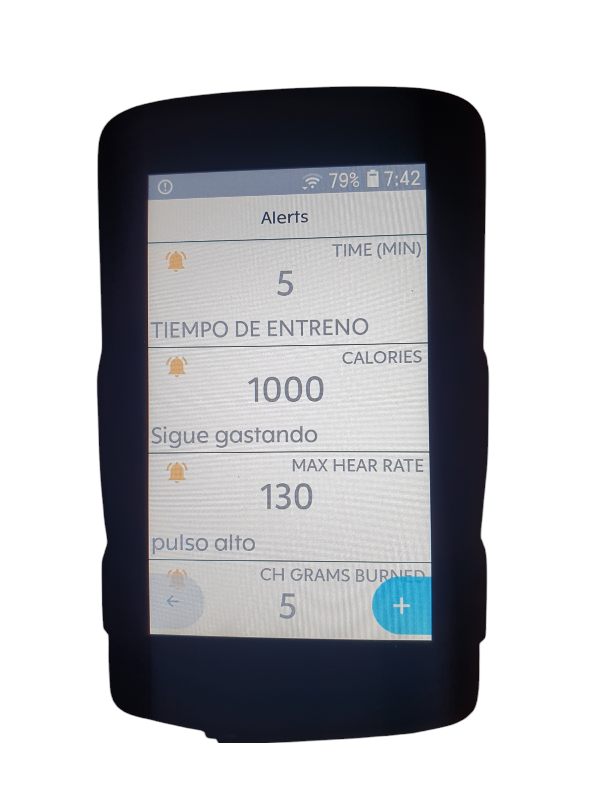 | 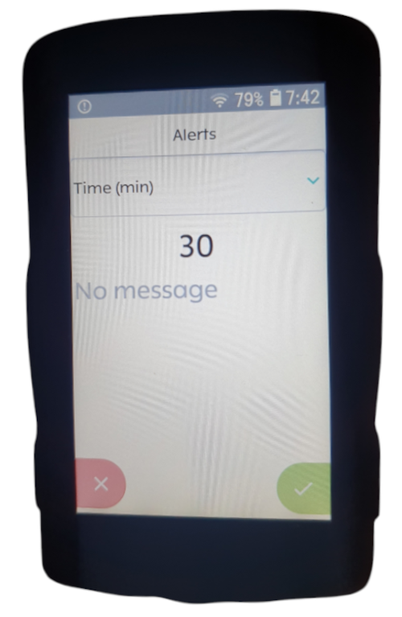 | 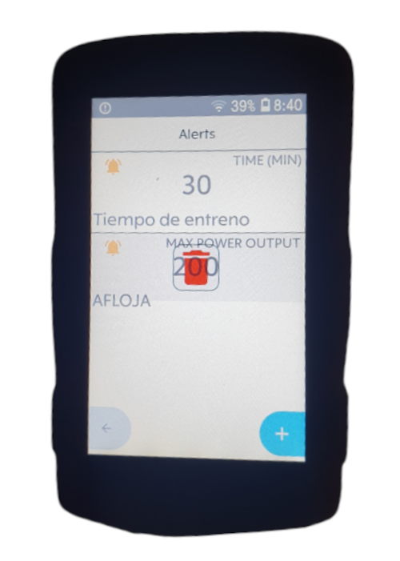 

Vin HkE allows to configure different alerts with sound warnings and pop-up texts. 

Right + button opens the new alert window.

By clicking on a pre-existing alert it is possible to modify its values, not its type. Within the detail window of an alert, left red button exits without saving the changes, right green buttom aplies changes.

Existing alerts can be enabled or disabled by pressing the bell button even you are on a route. Text or thresholds changes can be aplied on route too.

To delete an alert, do long press over it and when delete icon appears, press it to delete.

The alert types available are as follow:

* Time
* Maximum pulse
* Maximum power
* Calories burned
* Grams of Carbohydrates burned

Do you want more? Ask me!

### Pit board

Pit board management | QR | Message list | Remove message
------------- | ------------- | ------------- | ------------- 
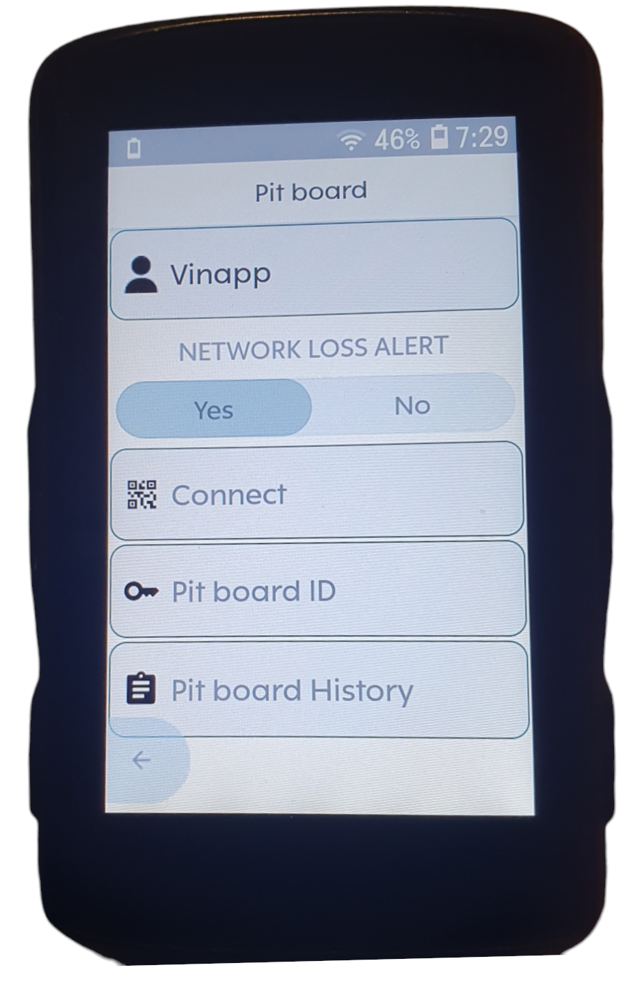 | 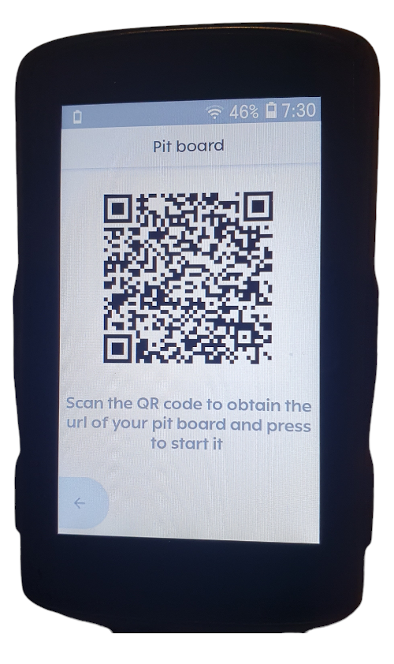 | 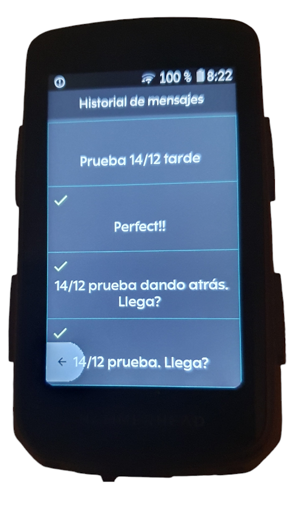 | 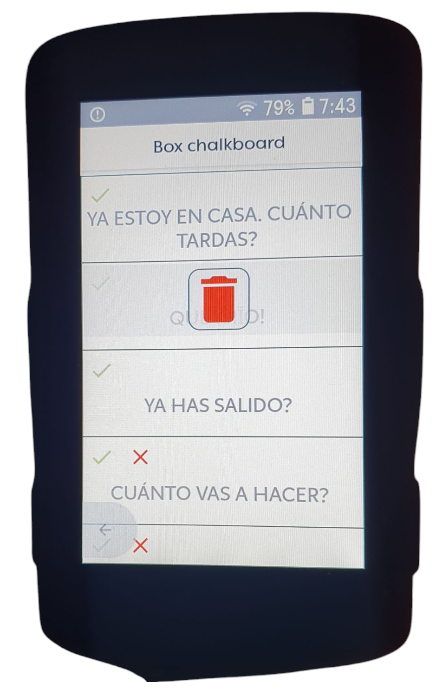

In the pit board window you can capture a QR code to obtain a link to the website from where your pit boss can manage the message board for you, while you are on the go. Add a Pit board widget to your profile to receive messages on real time while you have internet connection. Your pit boss can send you concise messages with up to 3 possible preconfigured responses. It can also send you merely informative messages, without any response available. When your pit boss sends you a message you will receive a special audible alert on your karoo. Without having to stop pedaling, you can move to your pit board widget to see what it has told you and, if applicable, send it a response. You don't need open HkE app, pit board is a widget inside your ride profile.

In the pit board window you must create a own nick to your pit boss can identify your pit board in scenarios with multiple riders at same time. This nick is optional.

Network advice option allow disable or enable audible warnings when your database connection are lost or gain.

Connect buttom creates a QR code to share with your pit boss.

Pit board ID buttom shows your unique ID. This ID is codificated in QR code and used to authenticate sessions in pit board web app.

Pit history shows in a list your last received messages while riding. This history will be deleted automatically after a few days.

### Vinapp Workout

Karoo workout | Vinapp library | Manual workout selection | Vinapp track library 
------------- | ------------- | ------------- | ------------- 
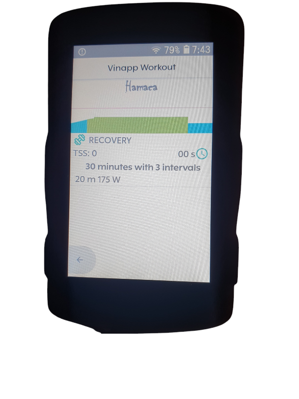 | 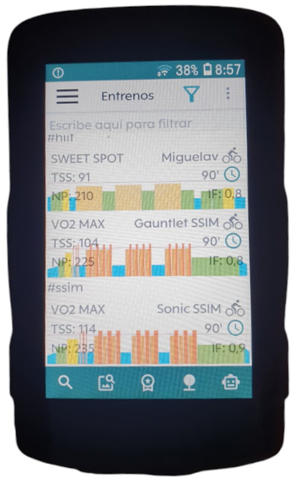 | 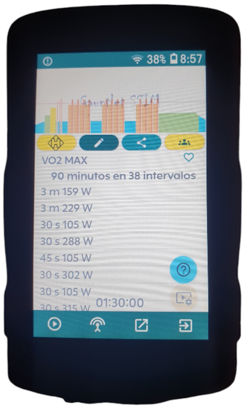 | 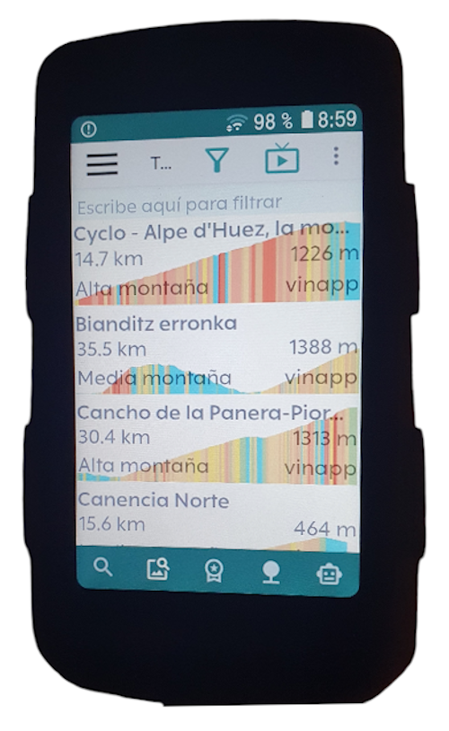

Workout widget allows to execute Vinapp workouts in your karoo rideapp. Vin HkE includes a sample workout. Vinapp is a free android app for cycling training and planing with 5 stars in google play. Installing Vinapp, HkE can sync Workout of the Day from Vinapp. User can select any of the hundreds workouts includes in Vin app library or enjoy of his multiple plans.

Once Vinapp is installed in karoo, HkE bind a service that sync workout of the day automatically. If user have not a selected plan Vinapp allows direct selection of any workouts includes in Vinapp with a simple clic on yellow hammerhead logo button and sync it in HkE.

<table border="0">
    <tr>
        <td width="50%" >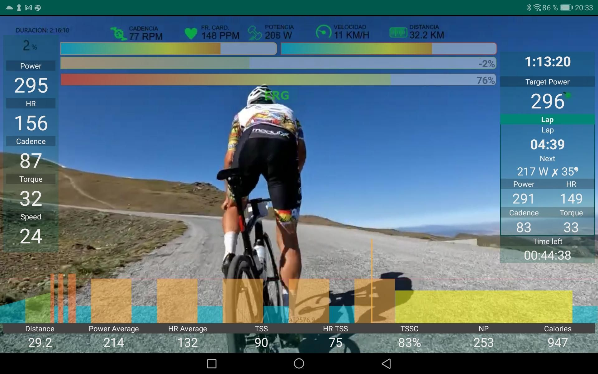</td>
        <td width="50%">
Vinapp can be installed in any android device with OS version 6.0 or later. In this pic you can see a tablet excuting an ERG mode workout with Vinapp-TV view. This view integrates with youtube player.

              
This view is not available for karoo due screen size considerations.

              
Vinapp requires an user account in order to share your data between all your devices through cloud.

        </td>
    </tr>
</table>

You can decide use Vinapp directly like workout executor. Vinapp have a powerful simulator and complex workout executor that you can use in karoo. No sensor linking is necesary. Vinapp implements Karoo extensions to read data from sensors linked to karoo in a transparent way. 

Vinapp can manage smart trainers to executing workouts in ERG mode or simulating your favorite traks, from gpx files or from its library. In order to Vinapp take the control of your smart trainer you must link it to Vinapp by pushing antenne button inside its workout executor, or its tracks simulator. Take the control of smart trainers is not possible thoug Extensions SDK. 

Vinapp has advanced statistics to track your training loads and plan your fitness peak accordingly. Vin Hke + Vinapp is a winner combo for karoo.

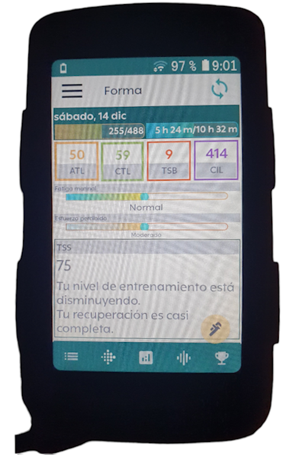

You can download Vinapp for karoo with Extensions SDK here: 

https://github.com/maduwatas/Vin-HkE/releases/download/latest/Vin-release.apk

# Extension widgets

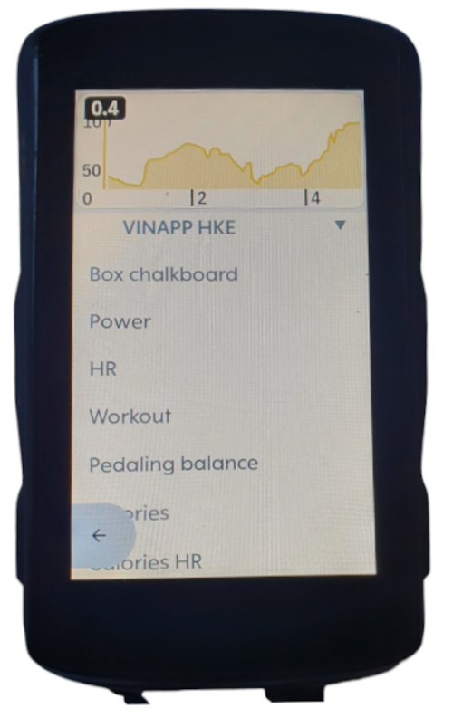

In your karoo's profile window you will see all the additional fields that the Vin HkE provides for your karoo. You can choose several graphic fields and a simple text field with calories burned estimated from heart rate.

For the graphic fields of power, heart rate, calories consumed and power balance, we recommend choosing the single row layout with two free fields and the Vin HkE graphic field below.

Power balance widget can be integrated with 4 additional standard fields.

For the Pit Board or workout widget you must choose a full screen graphic field.

## Calories estimated by Heart Rate 

A single field with calories consumpiton estimation, hear rate based

## Graphical Power

<table border="0">
    <tr>
        <td width="50%" >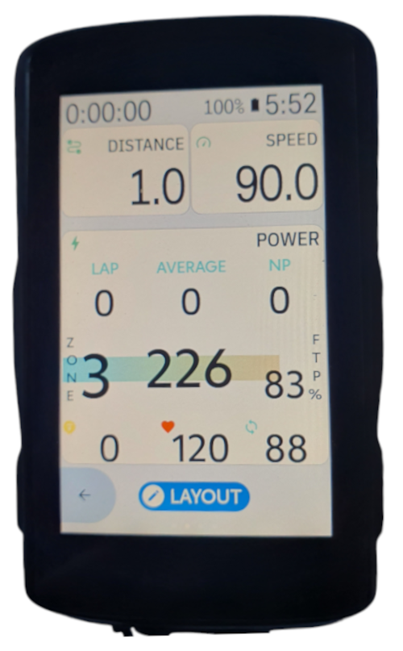</td>
        <td width="50%">Complete data power widget with graphical progress bar FTP based. Instant power, average power and average interval power have graphics power bars. Power zone, normalized power, power percent relative to FTP, kJ burned, cadence (if exists) and heart rate (if exists) are secundary data for this widget.</td>
    </tr>
</table>
 | 

## Graphical Hear rate

<table border="0">
    <tr>
        <td width="50%" >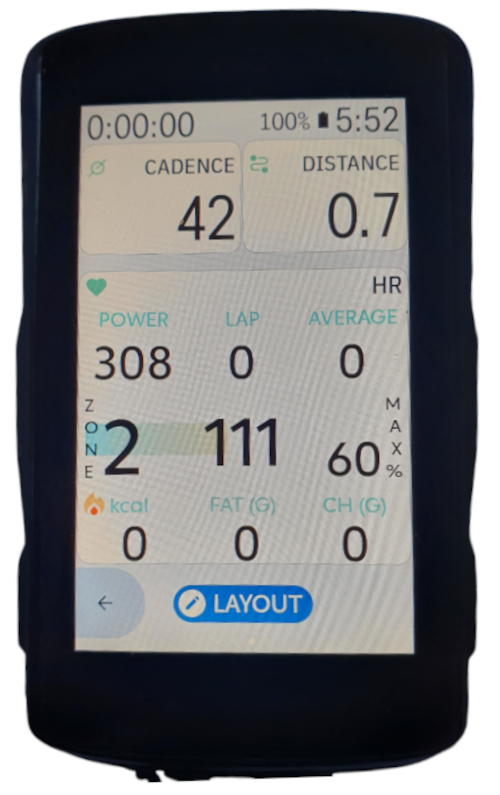</td>
        <td width="50%">Complete data heart rate widget with graphical progress bar Heart rate threshold based. Instant heart rate, average heart rate and average interval heart rate have graphics power bars. Heart rate zone, calories burned , heart rate percent relative to maximun hear rate, power (if exists) and cadence (if exists) are secundary data for this widget.</td>
    </tr>
</table>

## Graphical Power balance

> [!NOTE]  
> Disabled in 1.1.7. Will come back soon

<table border="0">
    <tr>
        <td width="50%" >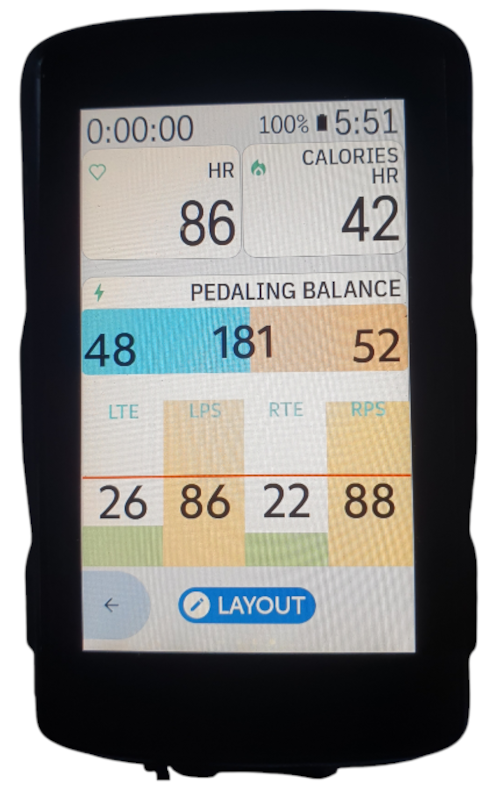</td>
        <td width="50%">Power balance data for dual powermeters. This widget shows graphical progress bar for power balance left-right, pedal smoothness left-right and torque effectiveness left-right.</td>
    </tr>
</table>

## Calorie consumption

<table border="0">
    <tr>
        <td width="50%" >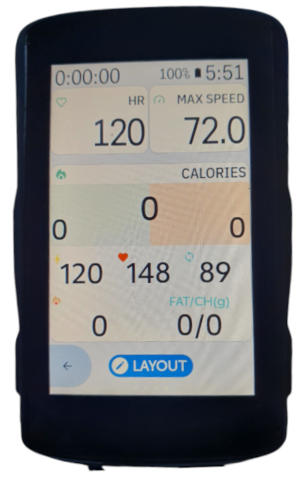</td>
        <td width="50%">Complete data caloric consumption widget. Shows instant caloric consumption speed total, fat and carbohydrate. Total grams of fat and charbohydrate burned.</td>
    </tr>
</table>

## Workout execution

<table border="0">
    <tr>
        <td width="50%" >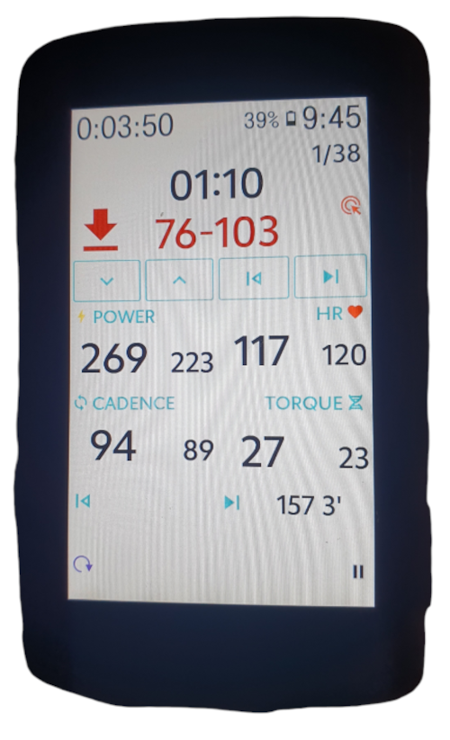</td>
        <td width="50%">Vinapp's workout execution screen shows you all the relevant information about your structured training. Workout execution power based or heart rate based are implemented. 
        Before starting the workout you will be able to see its graphic design. Once you start the workout, the entire screen is used to show current, previous and next goal, action buttons and power, cadence, pulse and torque data, as well as the average data in each interval. 
        The action buttons allow you to raise or lower the target in line, as well as navigate forward and backward intervals.
        Next to the target power data you will see arrow icons and color codes appear that will indicate if you are below or above the target zone.
        The screen has audible alerts of interval change.</td>
    </tr>
</table>

## Pit board 

Question or message | Question answered | Remote pit board
------------- | ------------- | ------------- 
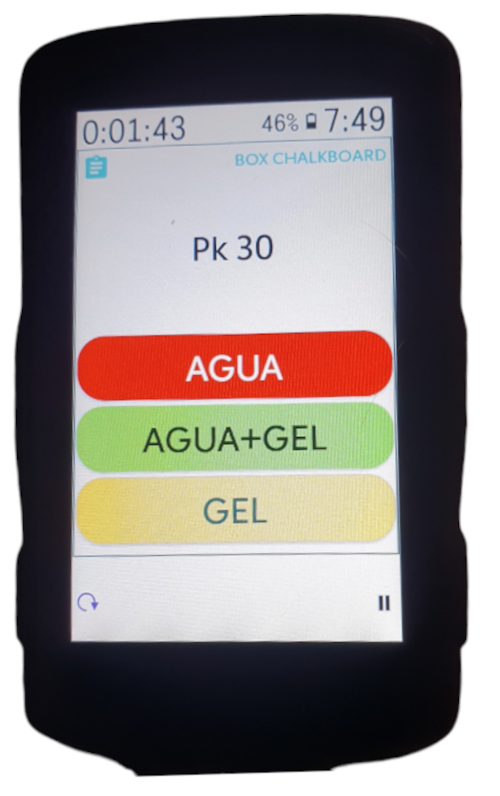 | 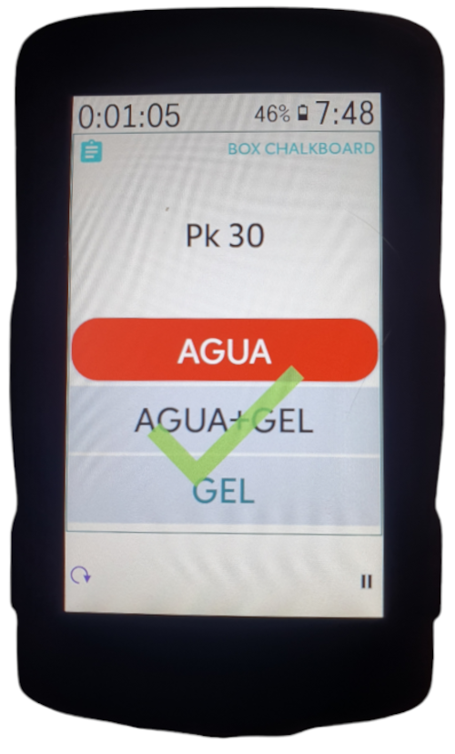 | 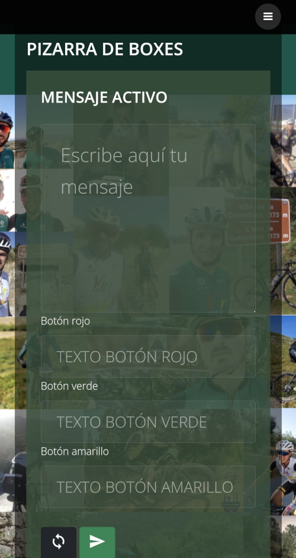

This is the most special functionality of Vin HkE. By inserting this screen in your profile you can receive the messages that your team sends you while you are on route. You will be able to receive important information without having to stop. Your pit manager can send you up to 3 different options so you can respond. 

I'm on pk 53, what do you need? -> WATER, WATER+GEL, NEW LEGS. 

Your boss will have everything ready when you arrive. How important is it for you to know how much you get out of your rival? With the pit board your boss will be able to take time when you pass and inform you immediately as soon as your rival passes.

Pit board widget requires internet connection though wifi or simcard. If you losses connection Pit board will do automatic reconnection when it has possible. While has internet connection pit board will update in real time. In the future we work in bluetooth link for K3 though Hammerhead Companion app.

We have many ideas to improve this functionality in the future, for example Bluetooth connection throug Companion app, multiple pit box dashboards, allowing an entire team to coordinate from a tablet, a karoo-karoo connection... this has only just begun.

> [!IMPORTANT]
> When karoo starts a new activity it disable wifi by default. HkE attempts to start wifi but not always get it due operating system restrictions. You will have an advice icon when losses internet access. > > In the major of case you must activate wifi manually at the start of your ride.

# SDK Implementation details

It is necessary to have the dependency on Hammerhead extensions for Vinapp HkE to work.

implementation("io.hammerhead:karoo-ext:1.x.y")

## Basic mechanics
When your karoo starts up, look in the manifests of the apps you have installed for the definition of the extension service.

<service
    android:name="es.xproject.vin.hammerhead.extension.HammerheadExtension"
    android:exported="true"
    tools:ignore="ExportedService">
    <!-- Required for this extension to be discovered by the Karoo System -->
    <intent-filter>
        <action android:name="io.hammerhead.karooext.KAROO_EXTENSION" />
    </intent-filter>
    <!-- Required for this extension to define resources and definitions -->
    <meta-data
        android:name="io.hammerhead.karooext.EXTENSION_INFO"
        android:resource="@xml/extension_info" />
</service>

Here we indicate which class must be executed to start your extension and in which file the data fields it includes are defined.

## HammerheadExtension main class
When the Vin HkE extension starts up it queries your user profile in the karoo, sets listeners for your activity status, starts collecting data from your devices and stores it in a singleton object, the DeviceHandler.

## File extension_info
In this file you indicate the data fields that your extension includes. For each field you include you must indicate a name, description and an icon. The fields in which you are only going to show a numerical value will be graphical false, the rest will be graphical true
Finally, you must indicate the typeId attribute with a **unique identifier** that will help karoo identify which view it should show when the user selects this field. For example

**typeId="custom-calories"** in the xml

class CustomCaloriesDataType(
private val karooSystem: KarooSystemService,
extension: String,
) : **DataTypeImpl(extension, "custom-calories")** in view data type class

## Views
Extension views are implemented by two classes. The Typo class collects the data and updates the view's Composable. The Composable class creates the view itself from data collected directly by its associated type.
Extensions are developed to consume composables that must be built with Glance. In my example I have used Glance only to return a container in which I insert Remoteviews developed in the classic way, that is, with xml layouts. I have taken this option because it is the one I master, but the normal thing would be to use glance. One of the problems with my approach is that you have to control the theme manually, to change the colors of the texts.

## Vinapp FIT Manager
When you start an activity, an object is also started in the Vinapp core that stores all the instant data sent by your devices in records with a FIT structure.
The FIT object can later be used in all the extensions you design without needing to establish dependencies on all the necessary devices. This way your extensions can work even if not all the data they display is being collected. That is, views can use the data collected by their associated Type or consume the DeviceHandler object provided by Vinapp.
The FIT object allows complex calculations from the collected data.

## APK
Download Vinapp HkE here: https://github.com/maduwatas/Vin-HkE/releases/download/latest/Vin-HkE.apk

