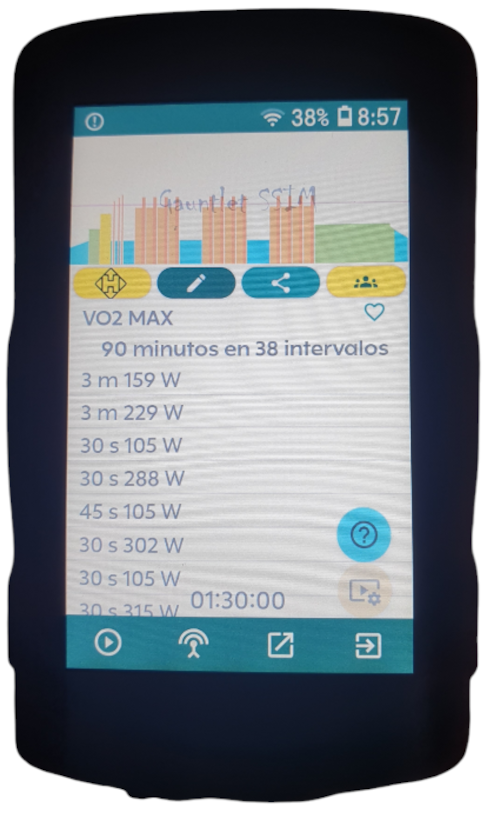
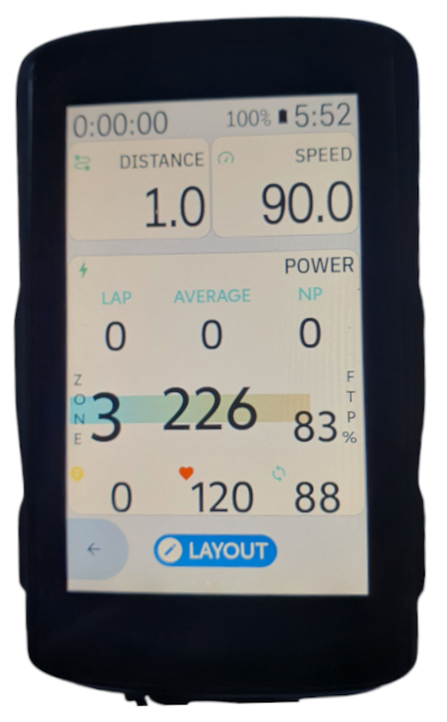
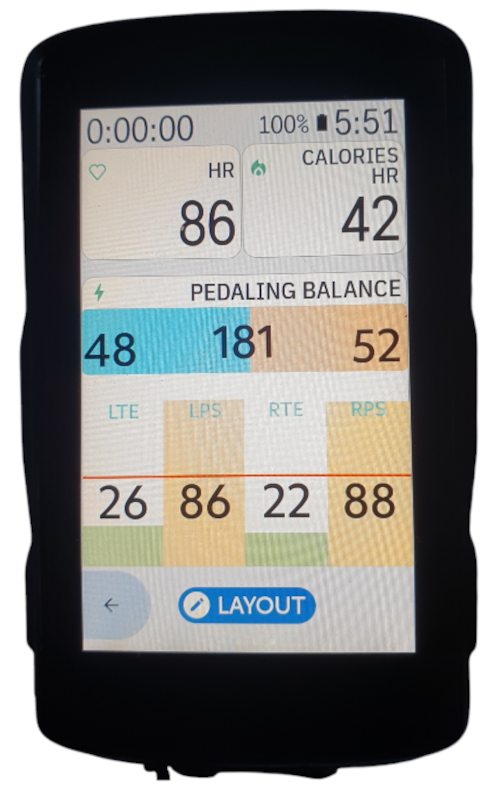
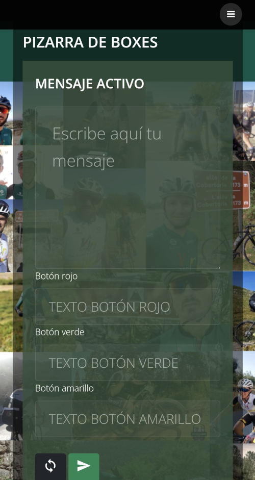

# Vinapp HkE

Vinapp HkE es una implementación de extensión para Karoo Hammerhead basada en Vin's CORE y el nuevo SDK Hammerhead para sus dispositivos GPS. Probado en dispositivos Hammerhead K2 y K3.

# HkE app Navigation

### Main menu

El menú principal proporciona acceso a la configuración del usuario y a la configuración de partes básicas de la aplicación.

### User profile configuration

User profile | Power threshold data | Hear rate threshold data | Nutritional data
------------- | ------------- | ------------- | -------------
 |  |  | 

Algunos datos se importan del perfil de usuario de karoo. Estos datos no son editables. Los datos de sexo, peso, altura y umbral del usuario son necesarios para ajustar los cálculos de calorías quemadas en la actividad. Los datos nutricionales aportan información sobre estos cálculos, para diferentes intensidades.

### Alerts

Alert list | Create or update alert | Delete alert
------------- | ------------- | -------------
 |  |  

HkE Vin te permite configurar diferentes alertas con avisos sonoros y textos emergentes. 

Usando el botón + el usuario puede agregar una nueva alerta.

Al hacer clic en una alerta preexistente es posible modificarla. Dentro de la ventana de detalles de una alerta, el botón X sale sin guardar los cambios.

Las alertas existentes se pueden activar o desactivar presionando el botón de campana.

Para eliminar una alerta, mantenga presionada y cuando aparezca el ícono de eliminar, presiónelo.

Los tipos de alerta disponibles son los siguientes:

* Tiempo
* Pulso máximo
* Potencia máxima
* Calorías quemadas
* Gramos de Carbohidratos quemados

¿Quieres más? ¡Pregúnteme!

### Box chalkboard

Chalkboard submenu | Message list | Message detail | Remove message
------------- | ------------- | ------------- | -------------
 |  |  | 

Desde la gestión de tu tablero de boxes podrás capturar el código QR para obtener el enlace al sitio web desde donde tu jefe de boxes podrá enviarte mensajes mientras estás en movimiento. Agregue la ventana Pit Chalkboard a su perfil para recibir mensajes. Tu jefe de sala puede enviarte mensajes concisos con hasta 3 respuestas posibles. También puede enviarle mensajes meramente informativos, sin que haya respuesta disponible. Cuando su jefe de sala le envíe un mensaje, recibirá una alerta audible especial en su karoo. Sin tener que dejar de pedalear, podrás acercarte a tu tabla para ver qué te ha dicho y, en su caso, enviarle una respuesta.

En la ventana de gestión de la aplicación también tienes acceso al historial de mensajes que has intercambiado con tu jefe de sala en las últimas 24 horas, siempre y cuando él o ella no los borre.
### Vinapp Workout

Karoo workout | Vinapp library | Manual workout selection 
------------- | ------------- | ------------- 
 |  | 

El widget de entrenamiento permite ejecutar entrenamientos de Vinapp. Vin HkE incluye un entrenamiento de muestra. Vinapp es una aplicación gratuita Android para entrenamiento y planificación ciclista con 5 estrellas en Google Play. La instalación de Vinapp HkE puede sincronizar el entrenamiento del día desde la aplicación Vin. El usuario puede seleccionar cualquiera de los cientos de entrenamientos incluidos en la biblioteca de la aplicación Vin y disfrutar de sus múltiples planes.

Una vez que Vinapp está instalado en karoo, HkE vincula un servicio que sincroniza automáticamente el entrenamiento del día. Si el usuario no tiene un plan seleccionado, Vinapp permite la selección directa de cualquier entrenamiento incluido en Vinapp con un simple clic en el botón amarillo con el logotipo del tiburón martillo y sincronícelo en HkE.

# Extension widgets

En la ventana de perfil de tu karoo verás todos los campos adicionales que l a Extensión Vin proporciona para tu karoo. Puedes elegir varios campos gráficos y un campo de texto simple con las calorías quemadas estimadas a partir de la frecuencia cardíaca.

Para los campos gráficos de potencia, pulso, calorías consumidas y balance de potencia, recomendamos elegir el diseño de una sola fila con dos campos libres y el campo gráfico Vin HkE a continuación.

Para el Pit Board deberás elegir un campo gráfico a pantalla completa.

## Calories estimated by Heart Rate 

Consumo de calorías basado en la frecuencia cardíaca

## Graphical Power

<table border="0">
    <tr>
        <td width="50%" ></td>
        <td width="50%">Widget de energía con barra de progreso gráfica basada en FTP. La potencia instantánea, la potencia promedio y la potencia de intervalo promedio tienen barras de potencia gráfica. La zona de potencia, la potencia normalizada, el porcentaje de potencia relativa a FTP, los kJ quemados, la cadencia (si existe) y la frecuencia cardíaca (si existe) son datos secundarios para este widget.</td>
    </tr>
</table>
 | 

## Graphical Hear rate

<table border="0">
    <tr>
        <td width="50%" ></td>
        <td width="50%">Widget de frecuencia cardíaca con barra de progreso gráfica basada en umbral de frecuencia cardíaca. La frecuencia cardíaca instantánea, la frecuencia cardíaca promedio y la frecuencia cardíaca de intervalo promedio tienen barras de potencia gráficas. La zona de frecuencia cardíaca, las calorías quemadas, el porcentaje de frecuencia cardíaca en relación con la frecuencia cardíaca máxima, la potencia (si existe) y la cadencia (si existe) son datos secundarios para este widget.</td>
    </tr>
</table>

## Graphical Power balance

<table border="0">
    <tr>
        <td width="50%" ></td>
        <td width="50%">Datos de balance de potencia para medidores de potencia duales. Este widget muestra una barra de progreso gráfica para el equilibrio de potencia de izquierda a derecha, la suavidad del pedal de izquierda a derecha y la efectividad del torque de izquierda a derecha.
</td>
    </tr>
</table>

## Calorie consumption

<table border="0">
    <tr>
        <td width="50%" ></td>
        <td width="50%">Widget de datos de consumo calórico. Muestra la velocidad instantánea del consumo calórico total, grasas y carbohidratos. Gramos totales de grasas y carbohidratos quemados.</td>
    </tr>
</table>

## Workout execution

<table border="0">
    <tr>
        <td width="50%" ></td>
        <td width="50%">La pantalla de ejecución del entrenamiento de Vinapp te muestra toda la información relevante sobre tu entrenamiento estructurado. Por el momento solo se implementan entrenamientos de potencia, pero pronto también estará disponible para entrenamientos basados en frecuencia cardíaca. 
        Antes de comenzar el entrenamiento podrás ver su diseño gráfico. Una vez que inicias el entrenamiento, toda la pantalla se utiliza para mostrar el objetivo actual, anterior y siguiente, botones de acción y datos de potencia, cadencia, pulso y torsión, así como los datos promedio en cada intervalo. 
        Los botones de acción le permiten subir o bajar el objetivo en línea, así como navegar en intervalos hacia adelante y hacia atrás.
        Junto a los datos de potencia objetivo, verá iconos de flechas y aparecerán códigos de colores que indicarán si está por debajo o por encima de la zona objetivo.
        La pantalla tiene alertas audibles de cambio de intervalo.</td>
    </tr>
</table>

## Box Chalkboard 

Chalkboard question | Question answered | Remote Box
------------- | ------------- | ------------- 
 |  | 

Esta es la funcionalidad más especial de HkE Vin. Insertando esta pantalla en tu perfil podrás recibir los mensajes que te envíe tu equipo mientras estás en ruta. Podrás recibir información importante sin tener que parar. Tu gerente de caja puede enviarte hasta 3 opciones diferentes para que puedas responder. Estoy en pk 53, ¿qué necesitas? -> AGUA, AGUA Y GEL, NADA. Tu jefe tendrá todo listo cuando llegues. ¿Qué importancia tiene para ti saber cuánto obtienes de tu rival? Con el tablero de cajas tu jefe podrá tomar tiempo cuando pases e informarte inmediatamente en cuanto pase tu rival.

Es necesario que tu Karoo tenga acceso a internet para que la placa funcione. Podrás utilizar tanto la tarjeta SIM del K2 como la conexión Wi-Fi a tu teléfono móvil que te proporcionan tanto el K2 como el K3. 

Tenemos muchas ideas para mejorar esta funcionalidad en el futuro, conexión Bluetooth, permitir coordinar a todo un equipo desde una tablet, conexión karoo-karoo… esto no ha hecho más que empezar.

# SDK Implementation details

Es necesario tener las dependencias para las extensiones de hammerhead. En la documentación oficial se indica un enlace para gradle pero a mí no me ha llegado a funcionar, asi que descargué la librería y la importo en el proyecto como en el sample.

implementation("io.hammerhead:karoo-ext:1.x.y")

## Basic mechanics
Cuando el karoo arranca busca en el manifiesto de la app la declaración del servicio que se conecta al core del sistema operativo. Hay que declarar el servicio e indicarle un archivo xml con la definición de campos adicionales, si es que tu app los tiene. En mi caso defino ese fichero para HkE pero no lo hago para Vin, que no expone nuevos campos.

<service
    android:name="es.xproject.vin.hammerhead.extension.HammerheadExtension"
    android:exported="true"
    tools:ignore="ExportedService">
    <!-- Required for this extension to be discovered by the Karoo System -->
    <intent-filter>
        <action android:name="io.hammerhead.karooext.KAROO_EXTENSION" />
    </intent-filter>
    <!-- Required for this extension to define resources and definitions -->
    <meta-data
        android:name="io.hammerhead.karooext.EXTENSION_INFO"
        android:resource="@xml/extension_info" />
</service>

Aquí le indicamos al core de las extensiones qué clase se debe ejecutar para iniciar tu extensión y en qué archivo están definidos los campos de datos que incluye.

## HammerheadExtension main class
Cuando HkE se inicia inicia un listener para obtener los datos del perfil de usuario. También incia otro listener para tener devoluciones de llamada cada vez que cambia el estado de la actividad. Es decir, si estamos en espera, inciamos, pausamos o finalizamos la actividad. Esas devoluciones de llamada las pasa a un objeto singleton que es el CORE de HkE, donde se realizan todos los cálculos necesarios para alimentar los widget.

## File extension_info
En este fichero se indican con un formato estandarizado cuales son los campos extra que provee la aplicación. Hay que indicar nombre, descripción y un icono. Los campos se pueden definir como gráficos o no gráficos. Los campos gráficos se implementan con una vista totalmente personalizada, mientras que los numéricos no se implementan con ninguna vista

Finalmente es necesario indicar el atributo typeId, que es un identificador único del campo. Este identificador lo debes asociar a cada clase que definas para un nuevo campo. Por ejemplo:

**typeId="custom-calories"** en el xml

class CustomCaloriesDataType(
private val karooSystem: KarooSystemService,
extension: String,
) : **DataTypeImpl(extension, "custom-calories")** en la clase DataType de tu campo adicional

## Views
Las vistas de los campos adicionales se implementan con una (no gráfico) o dos clases adicionales (gráficos). La clase Type recolecta los datos del core de karoo o de algún productor que tú definas y los proyecta hacia la vista. Si la vista es gráfica hay que definir un método adicional que llama a la clase que devuelve las RemoteViews al core del karoo. 
Las vistas de las extensiones está diseñadas para consumir composables, que se deben construir con glance. En mi caso, como no tengo soltura con glance y sí con las forma clásica de definir vistas uso un contenedor genérico, creo mis vistas de la forma clásica y luego inserto en el contenedor toda la vista construida como una RemoteView. Esto me permite más flexibilidad y capacidad de hacer cosas que usando el glance, que todavía limita mucho las posibilidades de diseño.

Un problema que tiene este enfoque es que debes manejar tú el cambio de color en los textos cuando el usuario cambia el modo a claro u oscuro.

## Vinapp FIT Manager
Cuando comienzas una actividad HkE inicia también un objeto singleton para almacenar los datos recogidos por los dispositivos con una frecuencia de 1 Hz. Este objeto almacena de forma persistente toda la información de tu actividad para prevenir la pérdida de datos de la sesión por un reinicio inesperado del dispositivo. Además, con toda la información almacenada puede calcular medias, datos normalizados y acumulados para proveer a las vistas de toda la información que necesitan.

Una ventaja que tiene usar este objeto es que no es necesario conectar a cada vista con todos los productores de datos que necesite visualizar, dado que el objeto singleton de HkE centraliza todos los cálculos y puede servir cualquier dato a cualquier vista. Las vistas deben estar, eso sí, vinculadas a algún dato del core de karoo para que éste las actualice. En mi caso, si la vista muestra datos de potencia la vinculo a este dato, pero otras vistas más genéricas las vinculo al cronómetro o incluso al reloj del sistema. 

## APK
Download Vinapp HkE here: https://github.com/maduwatas/Vin-HkE/releases/download/latest/

